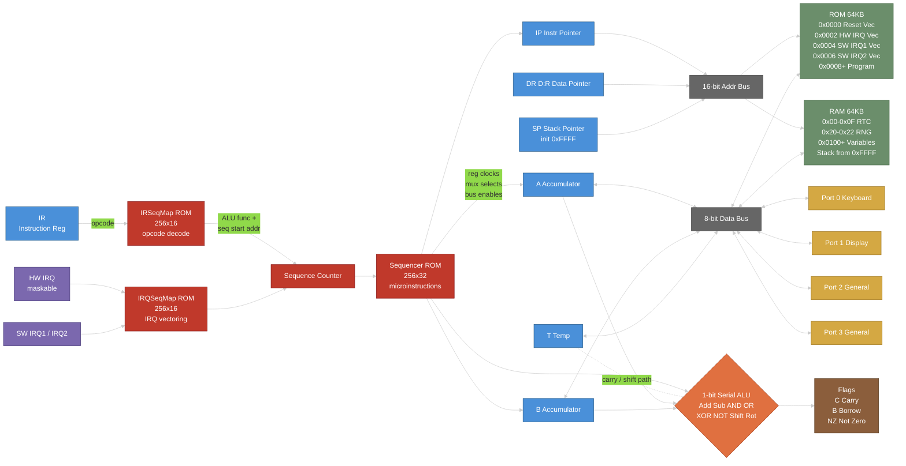

```mermaid
%%{init: {'theme': 'base', 'themeVariables': {'primaryColor': '#4a90d9', 'lineColor': '#ccc', 'textColor': '#eee', 'mainBkg': '#2b2b2b', 'clusterBkg': 'transparent', 'clusterBorder': '#888'}}}%%
graph LR

    %% ---- Control Unit ----
    IR["IR<br/>Instruction Reg"] -->|opcode| IRSEQ["IRSeqMap ROM<br/>256x16<br/>opcode decode"]
    IRSEQ -->|"ALU func +<br/>seq start addr"| SEQ_CTR["Sequence Counter"]
    SEQ_CTR --> SEQ_ROM["Sequencer ROM<br/>256x32<br/>microinstructions"]
    IRQSEQ["IRQSeqMap ROM<br/>256x16<br/>IRQ vectoring"] --> SEQ_CTR

    %% ---- Interrupt Sources ----
    HWIRQ["HW IRQ<br/>maskable"] --> IRQSEQ
    SWIRQ["SW IRQ1 / IRQ2"] --> IRQSEQ

    %% ---- Control signals fan out ----
    SEQ_ROM -->|"reg clocks<br/>mux selects<br/>bus enables"| A
    SEQ_ROM --> B
    SEQ_ROM --> ALU
    SEQ_ROM --> IP

    %% ---- 8-bit Registers ----
    A["A Accumulator"] <--> DBUS["8-bit Data Bus"]
    B["B Accumulator"] <--> DBUS
    T["T Temp"] <--> DBUS
    T -.-|"carry / shift path"| ALU

    %% ---- ALU ----
    ALU{"1-bit Serial ALU<br/>Add Sub AND OR<br/>XOR NOT Shift Rot"} --> FLAGS["Flags<br/>C Carry<br/>B Borrow<br/>NZ Not Zero"]
    A --> ALU
    B --> ALU

    %% ---- 16-bit Registers ----
    IP["IP Instr Pointer"] --> ABUS["16-bit Addr Bus"]
    DR["DR D:R Data Pointer"] --> ABUS
    SP["SP Stack Pointer<br/>init 0xFFFF"] --> ABUS

    %% ---- Memory ----
    ABUS --> ROM
    ABUS --> RAM
    DBUS <--> ROM["ROM 64KB<br/>0x0000 Reset Vec<br/>0x0002 HW IRQ Vec<br/>0x0004 SW IRQ1 Vec<br/>0x0006 SW IRQ2 Vec<br/>0x0008+ Program"]
    DBUS <--> RAM["RAM 64KB<br/>0x00-0x0F RTC<br/>0x20-0x22 RNG<br/>0x0100+ Variables<br/>Stack from 0xFFFF"]

    %% ---- I/O Ports ----
    DBUS <--> P0["Port 0 Keyboard"]
    DBUS <--> P1["Port 1 Display"]
    DBUS <--> P2["Port 2 General"]
    DBUS <--> P3["Port 3 General"]

    %% ---- Styling ----
    classDef reg fill:#4a90d9,stroke:#2c5f8a,color:#fff
    classDef alu fill:#e07040,stroke:#a04020,color:#fff
    classDef mem fill:#6b8e6b,stroke:#4a6b4a,color:#fff
    classDef io fill:#d4a843,stroke:#a07820,color:#fff
    classDef bus fill:#666,stroke:#444,color:#fff
    classDef ctrl fill:#c0392b,stroke:#8b1a1a,color:#fff
    classDef flag fill:#8b5e3c,stroke:#5a3a1e,color:#fff
    classDef irq fill:#7b68ae,stroke:#4a3d7a,color:#fff

    class A,B,T,IR,IP,DR,SP reg
    class ALU alu
    class FLAGS flag
    class ROM,RAM mem
    class P0,P1,P2,P3 io
    class DBUS,ABUS bus
    class SEQ_CTR,SEQ_ROM,IRSEQ,IRQSEQ ctrl
    class HWIRQ,SWIRQ irq
```
